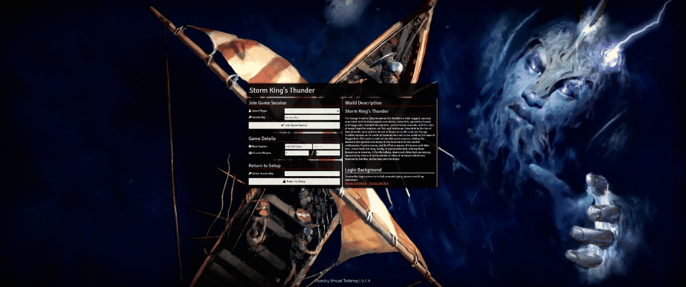
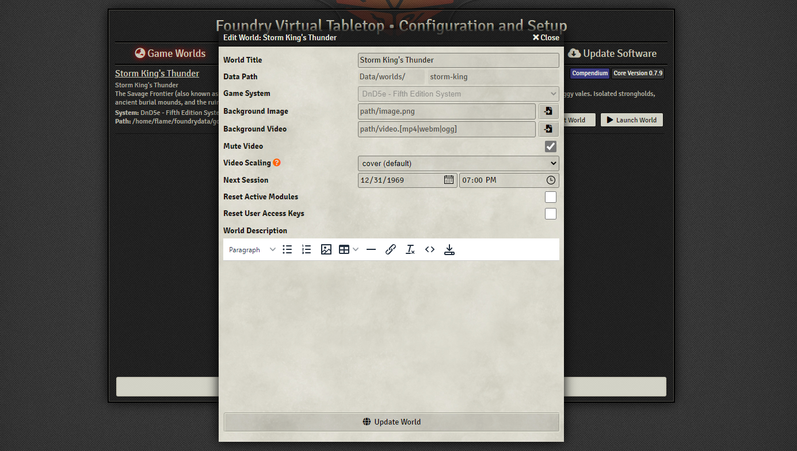

<pre>
 _____
 |  _ \
 | | | |_ __ __ _  __ _  ___  _ __
 | | | | '__/ _` |/ _` |/ _ \| '_ \
 | |/ /| | | (_| | (_| | (_) | | | |
 |___/ |_|  \__,_|\__, |\___/|_| |_|
     ______ _      __/ |
     |  ___| |    |___/
     | |_  | | __ _  __ _  ___  _ __
     |  _| | |/ _` |/ _` |/ _ \| '_ \
     | |   | | (_| | (_| | (_) | | | |
     \_|   |_|\__,_|\__, |\___/|_| |_|
                     __/ |
                    |___/
</pre>
## Enhancement Suite for Foundry VTT

## How to Install

### Windows

- From the [latest release](https://github.com/flamewave000/df-fvtt-enhancement-suite/releases/latest), download the `DFEnhancementSuitePatch.exe` file.
- Save the file to your FoundryVTT installation folder (not the data folder)
  - This can usually be found at `C:\Program Files\FoundryVTT`
- Run the program (it will need administrator privileges so accept that)
- Enjoy!

### Linux

- From the [latest release](https://github.com/flamewave000/df-fvtt-enhancement-suite/releases/latest), download the `DFEnhancementSuitePatch.sh` file
- Save the file to your FoundryVTT installation folder (not the data folder)
  - This can usually be found at `/home/<user>/foundryvtt` or wherever you unzipped it to
- If you have a Desktop, you should be able to double-click the file to run it
- Otherwise, simply run it in a terminal
- Enjoy!

### MacOS

- I do not own any Apple hardware and I am therefore unable to test my script on that platform. If anyone wishes to try it and let me know, I would be happy to try and get it working there as well.
- It generally needs to be run in the FoundryVTT folder where the `resources` directory can be found, as that contains the files that need to be patched.

## **You must re-run the patch when ever you update FoundryVTT**

## FVTT Setup Package Sorting
Alphabetically sorts the modules/packages on the server setup screens. The default sort is by "most recently updated", and can be difficult to navigate. This extension re-sorts the packages alphabetically.

## Login Screen Animated Background

The patch allows you to add a video background to your login screen. This will display over top of the set background image.

### How to use (GM only)

- In the new fields provided, you can specify the video path and various settings for playback.
- Click "Update World", launch your world and enjoy the view.
- File must have one of these supported extensions: `'mp4', 'm4v', 'ogg', 'webm'`

#### (RECOMMENDED) Provided Background Image Backup

It is recommended you set a backup image so that if a user does not have the extension running, they will still see a pretty image and not just a blank background.

### Adjust Video Scaling/Fit

The different forms of scaling are defined here

- **`cover` (default scaling):** The video is sized to fill the screen's entire area while maintaining its aspect ratio. The object will be clipped to fit.
- **`fill`:** The video is sized to fill the screen's entire area. If necessary, the object will be stretched or squished to fit.
- **`contain`:** The video is scaled to maintain its aspect ratio while fitting within the screen's area.
- **`scale-down`:** The video is sized as if `none` or `contain` were specified (would result in a smaller video size).
- **`none`:** The video is not resized.

